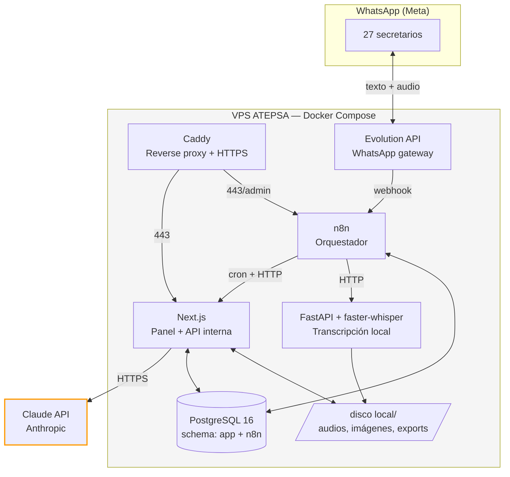
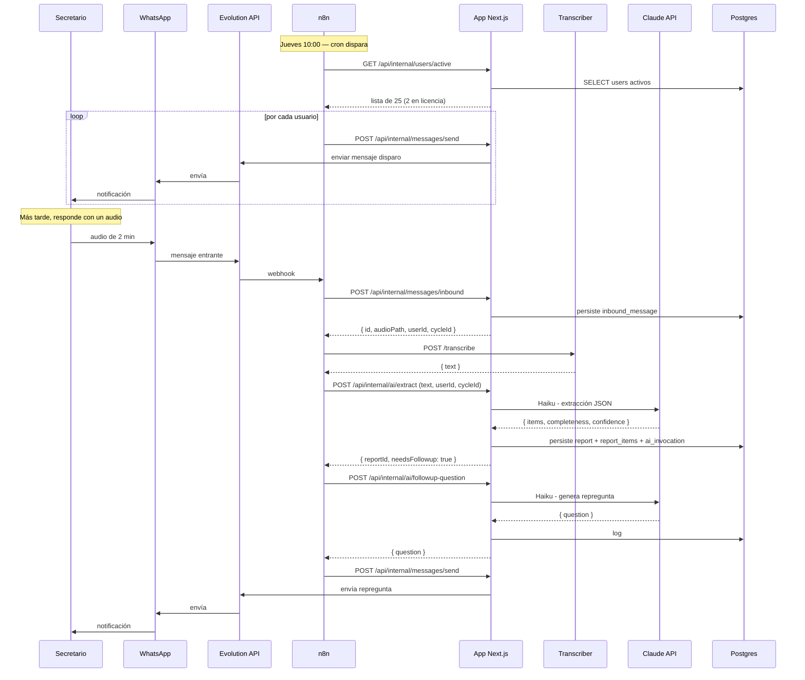
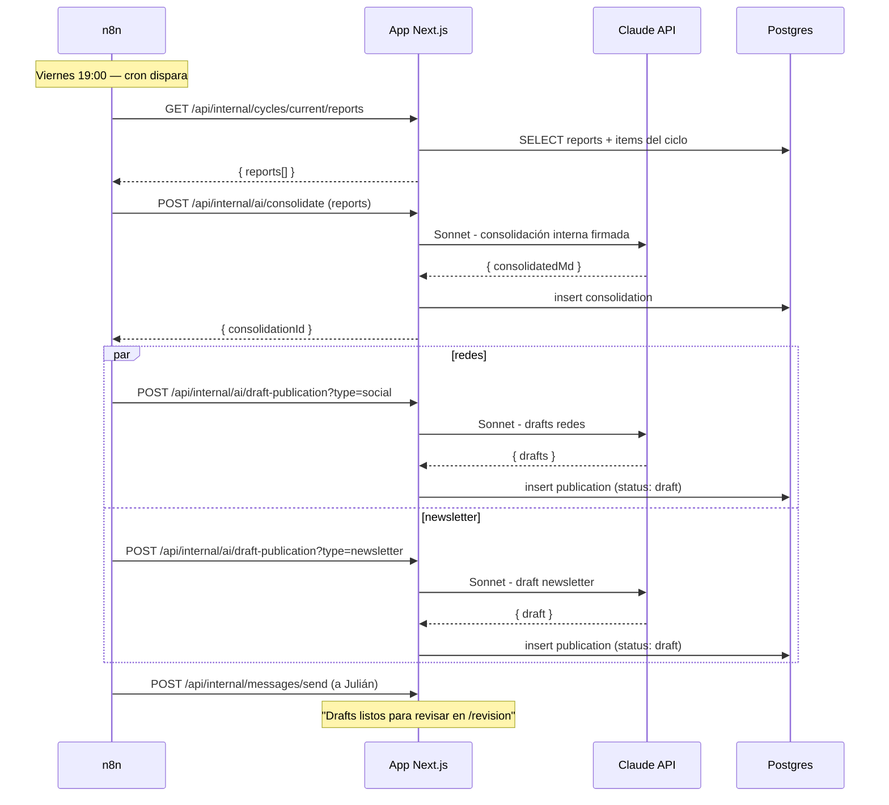

# Arquitectura

## Visión general

Sistema compuesto por seis servicios corriendo en Docker en el VPS de ATEPSA, comunicados por HTTP interno y compartiendo una base de datos PostgreSQL. Único punto de salida a internet: API de Claude (Anthropic).



---

## Componentes

### 1. Caddy (reverse proxy)

- Terminación HTTPS con certificados Let's Encrypt automáticos.
- Rutea tráfico público:
  - `panel.atepsa.org.ar` → Next.js
  - `n8n.atepsa.org.ar` → n8n (con basic auth adicional)
  - `evolution.atepsa.org.ar` → Evolution API (con API key)
- Bloquea acceso directo a Postgres, transcriber y endpoints `/api/internal/*` desde fuera del VPS.

### 2. Evolution API

- Gateway de WhatsApp. Escanea QR de un número dedicado, mantiene la sesión.
- Recibe mensajes y los envía como webhook a n8n (`POST /webhook/whatsapp-inbound`).
- Expone API HTTP para enviar mensajes (consumida por n8n y por la app Next.js para OTP).
- En el adapter pattern del código, esto está detrás de la interfaz `WhatsAppProvider`. Cuando migremos a Meta Cloud API, se reemplaza la implementación sin tocar el resto.

### 3. n8n

- Cron triggers: jueves 10:00 (disparo), viernes 12:00 (recordatorio), viernes 18:00 (cierre), viernes 19:00 (procesamiento), lunes 08:00 (devolución).
- Webhook trigger: mensajes entrantes desde Evolution.
- Llama a endpoints internos de Next.js (`/api/internal/*`) con `Authorization: Bearer <SHARED_SECRET>`.
- Llama al transcriber por HTTP.
- Workflows versionados en `n8n/workflows/*.json`.

### 4. Next.js (panel + API interna)

Dos roles bien diferenciados:

**Panel web (público, autenticado)**
- `/login` — pantalla de OTP.
- `/dashboard` — vista según rol.
- `/reportes/[id]` — detalle.
- `/ausencias` — gestión propia.
- `/revision` — bandeja del Sec. de Prensa.
- `/admin/*` — gestión de usuarios, prompts, logs.

**API interna (consumida por n8n)**
- `POST /api/internal/messages/inbound` — recibe mensaje crudo, lo persiste.
- `POST /api/internal/messages/send` — envía mensaje vía adapter.
- `POST /api/internal/ai/extract` — extrae reporte estructurado con Haiku.
- `POST /api/internal/ai/needs-followup` — clasifica si el reporte necesita repregunta.
- `POST /api/internal/ai/consolidate` — genera consolidado semanal con Sonnet.
- `POST /api/internal/ai/draft-publication` — genera draft de publicación con Sonnet.
- `GET /api/internal/cycles/current` — info del ciclo activo.
- `GET /api/internal/users/active` — usuarios activos esta semana (descuenta licencias).

Todas las rutas `/api/internal/*` validan `Authorization: Bearer <INTERNAL_API_SECRET>` y solo aceptan tráfico desde la red interna de Docker.

### 5. Transcriber (FastAPI + faster-whisper)

- Servicio Python aparte. Escucha en `:8000` (solo red interna).
- `POST /transcribe` — recibe path al archivo de audio (en el volumen compartido), devuelve texto en español.
- Usa modelo `medium` (~770MB en RAM), compute_type `int8` para CPU.
- Tiempo aproximado: 30-60s por minuto de audio en CPU.
- Encolado interno simple (semaphore para 1-2 jobs concurrentes según RAM disponible).

### 6. PostgreSQL 16

Una sola instancia, dos schemas:
- `public` (app) — usuarios, reportes, ciclos, ausencias, etc. Drizzle ORM.
- `n8n` — estado interno de n8n. Aislado del schema de la app.

Backup automático diario con `pg_dump` a `/backups/`, retención 30 días. Snapshot semanal a almacenamiento externo (a definir con Julián).

### 7. Filesystem local

Estructura en `/opt/atepsa-reportes/data/`:
```
data/
├── audio/
│   ├── inbound/    # audios crudos recibidos
│   └── archive/    # audios procesados, por año/semana
├── exports/        # PDFs, .xlsx generados
└── publications/   # imágenes y assets de publicaciones aprobadas
```

Backup junto con la DB.

---

## Flujo de datos: caso típico

Reporte de un secretario, de punta a punta:



Procesamiento semanal del viernes 19:00:



---

## Separación de responsabilidades

| Responsabilidad | Dueño |
|---|---|
| Trigger por tiempo (cron) | n8n |
| Trigger por evento WhatsApp | Evolution → n8n |
| Persistencia de mensajes crudos | App (vía endpoint interno llamado por n8n) |
| Modelo de dominio (users, reports, cycles) | App (Drizzle) |
| Llamadas a Claude API | App (centralizado en `lib/ai/`) |
| Prompts | App (`apps/web/src/lib/ai/prompts/`) versionados en código + override en DB para edición desde panel |
| Transcripción | Transcriber service |
| Lógica de "necesita repregunta" | App (la decisión la toma Claude, pero el orquestamiento es n8n) |
| Encolado y reintentos | n8n (workflows con error branches) |
| Auth de usuarios | App (Auth.js) |
| Auth interna entre n8n y app | Shared secret en header HTTP |
| Backups | Script en `infra/scripts/`, cron del sistema |

**Regla de oro**: n8n **orquesta**, no contiene lógica de negocio. Si tenés que escribir más de 5 líneas de JS en un nodo Code de n8n, es señal de que esa lógica tiene que vivir en la app como endpoint interno.

---

## Adapter pattern para WhatsApp

```typescript
// apps/web/src/lib/whatsapp/provider.ts
export interface WhatsAppProvider {
  send(to: string, message: WhatsAppMessage): Promise<{ messageId: string }>;
  parseInbound(payload: unknown): InboundMessage;
}

// apps/web/src/lib/whatsapp/evolution.ts
export class EvolutionProvider implements WhatsAppProvider { ... }

// apps/web/src/lib/whatsapp/meta-cloud.ts (futuro)
export class MetaCloudProvider implements WhatsAppProvider { ... }

// apps/web/src/lib/whatsapp/index.ts
export const whatsapp: WhatsAppProvider =
  process.env.WHATSAPP_PROVIDER === 'meta'
    ? new MetaCloudProvider(...)
    : new EvolutionProvider(...);
```

Para migrar a Meta Cloud API: implementar `MetaCloudProvider`, cambiar env var, listo. El resto del código no se entera.

---

## Seguridad

- **Red Docker interna**: solo Caddy expone puertos al host. Postgres, transcriber, app y n8n se hablan por hostname interno (`postgres`, `transcriber`, `web`, `n8n`).
- **Secretos**: `.env` en el VPS (`/opt/atepsa-reportes/.env`), permisos `600`, dueño `root`. Nunca en el repo.
- **OTP**: códigos de 6 dígitos, validez 5 minutos, máximo 3 intentos, rate limit por número (1 OTP cada 60s).
- **Sesiones**: cookies httpOnly, secure, sameSite strict, 30 días.
- **CSRF**: protección nativa de Next.js Server Actions + token en mutaciones API.
- **Logs sensibles**: nunca loguear el contenido de los mensajes en plaintext en stdout (puede terminar en docker logs y backups de logs). Solo en DB con acceso controlado.
- **Tasa de Claude**: rate limiting por workflow para no quemar presupuesto si algo se loopea.

---

## Observabilidad

Para MVP, baseline:
- Logs estructurados (JSON con `pino`) a stdout, capturados por Docker.
- `docker compose logs -f --tail=200 web` para debugging.
- Tabla `ai_invocations` con todas las llamadas a Claude (input tokens, output tokens, costo estimado, latencia).
- Tabla `audit_log` con acciones admin.

Para una fase posterior (no MVP):
- Uptime check externo (UptimeRobot u oncalled, gratis).
- Dashboard de métricas (Grafana + Prometheus si vale la pena).
