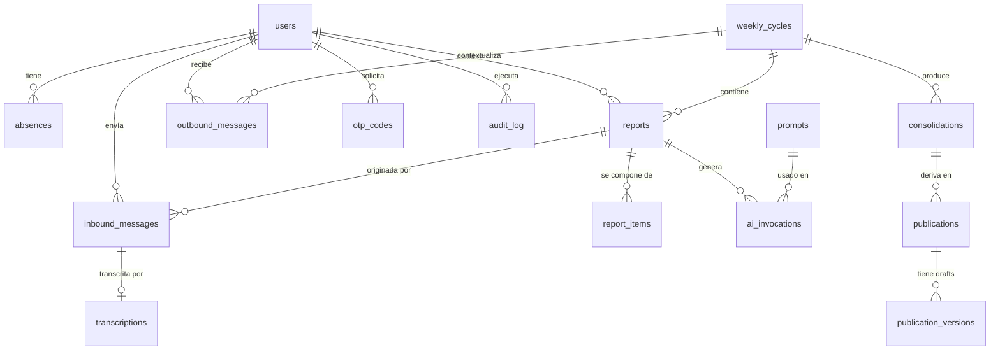

# Modelo de datos

Schema conceptual. Las migraciones reales se escriben con Drizzle en `apps/web/src/db/schema/` durante la Fase 2.

**Convenciones**:
- Nombres de tabla en `snake_case` plural.
- PK siempre `id` UUID v7 (ordenable por tiempo).
- Timestamps `created_at` y `updated_at` en todas las tablas, `timestamptz`.
- Soft delete con `deleted_at timestamptz NULL` solo en tablas donde aplica (users, prompts).
- FK con `ON DELETE RESTRICT` por default; explicitar `CASCADE` solo cuando tiene sentido semántico.

---

## Diagrama de entidades



---

## Tablas

### `users`

Los 27 miembros del Secretariado Nacional + cualquier usuario admin futuro.

| Campo | Tipo | Notas |
|---|---|---|
| `id` | uuid PK | |
| `full_name` | text NOT NULL | |
| `email` | text NULL UNIQUE | opcional, para contacto fuera del sistema |
| `phone_e164` | text NOT NULL UNIQUE | formato E.164, ej `+5491145678901` |
| `role` | enum (`secretary`, `executive`, `press_admin`) NOT NULL | Nivel 1, 2, 3 |
| `position` | text NULL | "Secretario Adjunto", "Vocal Titular", etc. |
| `is_active` | boolean NOT NULL DEFAULT true | da de baja sin borrar |
| `notes` | text NULL | notas internas del admin |
| `created_at` | timestamptz | |
| `updated_at` | timestamptz | |
| `deleted_at` | timestamptz NULL | soft delete |

Índices: `phone_e164`, `role`, `is_active`.

---

### `weekly_cycles`

Una fila por semana operativa. Se crea automáticamente al inicio de cada semana (lunes 00:00).

| Campo | Tipo | Notas |
|---|---|---|
| `id` | uuid PK | |
| `year` | int NOT NULL | 2026 |
| `iso_week` | int NOT NULL | 1-53 |
| `starts_at` | timestamptz NOT NULL | lunes 00:00 |
| `ends_at` | timestamptz NOT NULL | domingo 23:59:59 |
| `trigger_at` | timestamptz NOT NULL | jueves 10:00 |
| `reminder_at` | timestamptz NOT NULL | viernes 12:00 |
| `closes_at` | timestamptz NOT NULL | viernes 18:00 |
| `processed_at` | timestamptz NULL | viernes 19:00, se setea cuando termina el procesamiento |
| `published_at` | timestamptz NULL | cuando Julián aprueba el consolidado interno |
| `status` | enum (`pending`, `open`, `closed`, `processed`, `published`) NOT NULL | |
| `created_at` | timestamptz | |
| `updated_at` | timestamptz | |

Constraint: `UNIQUE(year, iso_week)`.
Índices: `status`, `starts_at`.

---

### `absences`

Vacaciones programadas + pausas semanales.

| Campo | Tipo | Notas |
|---|---|---|
| `id` | uuid PK | |
| `user_id` | uuid FK users | |
| `type` | enum (`scheduled_leave`, `weekly_pause`) NOT NULL | |
| `starts_on` | date NOT NULL | |
| `ends_on` | date NOT NULL | para weekly_pause, == starts_on + 6 días (la semana) |
| `reason` | text NULL | opcional |
| `source` | enum (`whatsapp`, `panel`, `admin`) NOT NULL | dónde se registró |
| `registered_by` | uuid FK users | quién la registró (puede ser el mismo user o un admin) |
| `created_at` | timestamptz | |

Índices: `user_id`, `starts_on`, `ends_on`, `(user_id, starts_on, ends_on)` compuesto.
**No** hay unicidad: un user puede tener múltiples licencias en el año.

Query típico: "¿está user X de licencia en fecha Y?" → existe absence con `user_id=X AND starts_on <= Y AND ends_on >= Y`.

---

### `inbound_messages`

Mensajes crudos recibidos por WhatsApp. Una fila por mensaje. Se persisten incluso si después se descartan.

| Campo | Tipo | Notas |
|---|---|---|
| `id` | uuid PK | |
| `provider` | text NOT NULL | `evolution` o `meta_cloud` |
| `provider_message_id` | text NOT NULL | id del mensaje en el provider |
| `from_phone_e164` | text NOT NULL | |
| `user_id` | uuid FK users NULL | NULL si el número no está registrado |
| `cycle_id` | uuid FK weekly_cycles NULL | ciclo activo al momento de recibirlo |
| `kind` | enum (`text`, `audio`, `other`) NOT NULL | |
| `text_content` | text NULL | si es texto, el contenido |
| `audio_path` | text NULL | si es audio, path en filesystem |
| `audio_duration_sec` | int NULL | |
| `raw_payload` | jsonb NOT NULL | el JSON crudo del provider, para debugging |
| `intent` | enum (`report`, `report_followup_reply`, `absence_request`, `weekly_pause`, `unknown`) NULL | clasificación rápida (heurística + IA) |
| `received_at` | timestamptz NOT NULL | |
| `processed_at` | timestamptz NULL | |
| `discarded_at` | timestamptz NULL | si se descartó (número no registrado, fuera de ventana, etc.) |
| `discard_reason` | text NULL | |

Constraint: `UNIQUE(provider, provider_message_id)`.
Índices: `user_id`, `cycle_id`, `received_at`, `intent`.

---

### `transcriptions`

Una transcripción por audio.

| Campo | Tipo | Notas |
|---|---|---|
| `id` | uuid PK | |
| `inbound_message_id` | uuid FK inbound_messages UNIQUE | |
| `text` | text NOT NULL | |
| `language` | text NOT NULL DEFAULT 'es' | |
| `model` | text NOT NULL | `faster-whisper-medium` |
| `duration_sec` | numeric NOT NULL | tiempo que tardó la transcripción |
| `created_at` | timestamptz | |

---

### `reports`

Reporte semanal de un usuario en un ciclo. Una fila por (user, cycle) en estado final.

| Campo | Tipo | Notas |
|---|---|---|
| `id` | uuid PK | |
| `user_id` | uuid FK users | |
| `cycle_id` | uuid FK weekly_cycles | |
| `status` | enum (`draft`, `awaiting_followup`, `complete`, `paused`, `on_leave`, `no_report`) NOT NULL | |
| `completeness_score` | numeric NULL | 0-1, lo asigna la IA |
| `summary_md` | text NULL | resumen final del reporte (post-consolidación de mensajes) |
| `first_message_at` | timestamptz NULL | |
| `last_message_at` | timestamptz NULL | |
| `followup_count` | int NOT NULL DEFAULT 0 | cuántas repreguntas se le hicieron |
| `created_at` | timestamptz | |
| `updated_at` | timestamptz | |

Constraint: `UNIQUE(user_id, cycle_id)` parcial donde `status != 'no_report'` (los "no_report" se generan al cierre del ciclo, uno por cada user que faltó).
Índices: `user_id`, `cycle_id`, `status`.

**Estados explicados**:
- `draft`: llegaron mensajes pero el ciclo no cerró todavía.
- `awaiting_followup`: la IA repreguntó y espera respuesta.
- `complete`: cerrado y la IA lo dio por completo.
- `paused`: el user dijo "esta semana paso".
- `on_leave`: el user estaba con licencia programada.
- `no_report`: cerró el ciclo y no hubo respuesta.

---

### `report_items`

Cada ítem temático extraído del reporte. Un reporte puede tener varios ítems.

| Campo | Tipo | Notas |
|---|---|---|
| `id` | uuid PK | |
| `report_id` | uuid FK reports | |
| `category` | text NOT NULL | categoría taxonómica (ver más abajo) |
| `title` | text NOT NULL | título corto del ítem |
| `description_md` | text NOT NULL | descripción extendida |
| `mentions` | jsonb NULL | array de menciones: orgs (EANA, ANAC), personas, lugares |
| `priority` | enum (`low`, `medium`, `high`) NULL | si la IA estima urgencia |
| `is_public_safe` | boolean NOT NULL DEFAULT true | si puede ir a outputs públicos (la IA marca falsos para conflictos internos sensibles) |
| `order_index` | int NOT NULL | orden dentro del reporte |
| `created_at` | timestamptz | |

Índices: `report_id`, `category`, `is_public_safe`.

**Categorías propuestas** (lista cerrada, configurable en `system_settings`):
`negociacion_paritaria`, `condiciones_laborales`, `seguridad_operacional`, `comunicacion_interna`, `relacion_institucional`, `formacion_capacitacion`, `accion_gremial`, `juridico`, `prensa_difusion`, `administracion_interna`, `otros`.

---

### `consolidations`

El consolidado semanal generado por la IA a partir de todos los reportes del ciclo.

| Campo | Tipo | Notas |
|---|---|---|
| `id` | uuid PK | |
| `cycle_id` | uuid FK weekly_cycles UNIQUE | |
| `internal_summary_md` | text NOT NULL | el consolidado firmado para los 27 |
| `themes` | jsonb NOT NULL | árbol temático: { categoria: [{ title, contributors: [user_ids] }] } |
| `metrics` | jsonb NOT NULL | { total_users, reported, on_leave, paused, no_report, by_category: {...} } |
| `generated_at` | timestamptz NOT NULL | |
| `reviewed_by` | uuid FK users NULL | Julián, cuando aprueba |
| `reviewed_at` | timestamptz NULL | |
| `status` | enum (`draft`, `approved`, `sent`) NOT NULL | |

---

### `publications`

Cada output comunicacional candidato a publicarse.

| Campo | Tipo | Notas |
|---|---|---|
| `id` | uuid PK | |
| `cycle_id` | uuid FK weekly_cycles | |
| `consolidation_id` | uuid FK consolidations | |
| `kind` | enum (`internal_summary`, `social_instagram`, `social_facebook`, `social_x`, `newsletter`, `web_article`) NOT NULL | |
| `current_version_id` | uuid FK publication_versions NULL | apunta al draft activo |
| `status` | enum (`draft`, `in_review`, `approved`, `published`, `discarded`) NOT NULL | |
| `published_at` | timestamptz NULL | cuando Julián marca como "lo publiqué" |
| `published_url` | text NULL | URL donde quedó publicado (manual) |
| `created_at` | timestamptz | |
| `updated_at` | timestamptz | |

---

### `publication_versions`

Drafts y ediciones de una publicación. Cada vez que Julián edita en el panel, se crea una nueva versión (no se sobreescribe).

| Campo | Tipo | Notas |
|---|---|---|
| `id` | uuid PK | |
| `publication_id` | uuid FK publications | |
| `version_number` | int NOT NULL | 1, 2, 3... |
| `body_md` | text NOT NULL | contenido principal |
| `attachments` | jsonb NULL | imágenes, etc. |
| `meta` | jsonb NULL | { hashtags, mentions, char_count } |
| `source` | enum (`ai_generated`, `human_edited`) NOT NULL | |
| `created_by` | uuid FK users NULL | NULL si es ai_generated |
| `ai_invocation_id` | uuid FK ai_invocations NULL | si fue generada por IA, link al log |
| `created_at` | timestamptz | |

Constraint: `UNIQUE(publication_id, version_number)`.

---

### `ai_invocations`

Log de **toda** llamada a Claude. Crítico para auditoría, debugging y control de costos.

| Campo | Tipo | Notas |
|---|---|---|
| `id` | uuid PK | |
| `purpose` | enum (`extract`, `followup_question`, `consolidate`, `draft_social`, `draft_newsletter`, `classify_intent`, `other`) NOT NULL | |
| `model` | text NOT NULL | `claude-haiku-4-5-20251001` o `claude-sonnet-4-6` |
| `prompt_id` | uuid FK prompts NULL | qué prompt versionado se usó |
| `input_messages` | jsonb NOT NULL | mensajes enviados a la API |
| `output_text` | text NULL | respuesta cruda |
| `output_parsed` | jsonb NULL | si se parseó como JSON, el resultado |
| `input_tokens` | int NOT NULL | |
| `output_tokens` | int NOT NULL | |
| `cache_read_tokens` | int NOT NULL DEFAULT 0 | si usamos prompt caching |
| `cost_usd` | numeric(10,6) NOT NULL | calculado con tabla de precios |
| `latency_ms` | int NOT NULL | |
| `success` | boolean NOT NULL | |
| `error` | text NULL | |
| `triggered_by` | enum (`workflow`, `user_action`, `manual_test`) NOT NULL | |
| `related_report_id` | uuid FK reports NULL | |
| `related_cycle_id` | uuid FK weekly_cycles NULL | |
| `created_at` | timestamptz | |

Índices: `purpose`, `model`, `created_at`, `related_cycle_id`.

---

### `prompts`

Prompts versionados, editables desde el panel admin.

| Campo | Tipo | Notas |
|---|---|---|
| `id` | uuid PK | |
| `slug` | text NOT NULL | `extract-report`, `consolidate-internal`, etc. |
| `version` | int NOT NULL | |
| `model_hint` | text NOT NULL | `haiku` o `sonnet` (qué modelo se sugiere usar) |
| `system_prompt` | text NOT NULL | |
| `user_template` | text NOT NULL | con placeholders `{{var}}` |
| `output_schema` | jsonb NULL | JSON schema esperado de la respuesta (si aplica) |
| `is_active` | boolean NOT NULL | el activo para ese slug |
| `created_by` | uuid FK users | |
| `notes` | text NULL | razón del cambio |
| `created_at` | timestamptz | |

Constraint: `UNIQUE(slug, version)`. Partial unique: solo uno activo por slug `UNIQUE(slug) WHERE is_active`.

Los prompts iniciales vienen en código (`apps/web/src/lib/ai/prompts/*.ts`) y se siembran en DB con un seed script. Las ediciones posteriores se hacen desde el panel y crean nuevas versiones en DB. La app siempre lee el activo de DB.

---

### `outbound_messages`

Mensajes que el bot envió. Para auditoría y para correlacionar respuestas.

| Campo | Tipo | Notas |
|---|---|---|
| `id` | uuid PK | |
| `provider` | text NOT NULL | |
| `provider_message_id` | text NULL | id devuelto por el provider |
| `to_phone_e164` | text NOT NULL | |
| `user_id` | uuid FK users NULL | |
| `cycle_id` | uuid FK weekly_cycles NULL | |
| `purpose` | enum (`weekly_trigger`, `reminder`, `followup_question`, `consolidation_delivery`, `otp`, `admin_message`, `other`) NOT NULL | |
| `body` | text NOT NULL | |
| `meta` | jsonb NULL | |
| `sent_at` | timestamptz NOT NULL | |
| `delivery_status` | enum (`sent`, `delivered`, `read`, `failed`) NOT NULL DEFAULT 'sent' | |
| `error` | text NULL | |

Índices: `user_id`, `cycle_id`, `purpose`, `sent_at`.

---

### `otp_codes`

Códigos OTP para login. Se purgan a los 7 días.

| Campo | Tipo | Notas |
|---|---|---|
| `id` | uuid PK | |
| `user_id` | uuid FK users | |
| `phone_e164` | text NOT NULL | |
| `code_hash` | text NOT NULL | bcrypt del código |
| `expires_at` | timestamptz NOT NULL | now + 5min |
| `attempts` | int NOT NULL DEFAULT 0 | |
| `consumed_at` | timestamptz NULL | |
| `created_at` | timestamptz | |

Índices: `phone_e164`, `expires_at`.

---

### `audit_log`

Acciones administrativas: cambios de roles, edición de publicaciones, edición de prompts, cambios en usuarios, etc.

| Campo | Tipo | Notas |
|---|---|---|
| `id` | uuid PK | |
| `actor_user_id` | uuid FK users | |
| `action` | text NOT NULL | `user.created`, `prompt.updated`, `publication.approved`, etc. |
| `entity_type` | text NOT NULL | `user`, `prompt`, `publication`, ... |
| `entity_id` | uuid NOT NULL | |
| `before` | jsonb NULL | |
| `after` | jsonb NULL | |
| `meta` | jsonb NULL | IP, user-agent |
| `created_at` | timestamptz | |

Índices: `actor_user_id`, `entity_type`, `entity_id`, `created_at`.

---

### `system_settings`

Key-value para configuración runtime (categorías, horarios, modelos default, flags).

| Campo | Tipo | Notas |
|---|---|---|
| `key` | text PK | `report_categories`, `cycle_trigger_dow`, etc. |
| `value` | jsonb NOT NULL | |
| `updated_by` | uuid FK users | |
| `updated_at` | timestamptz | |

---

## Cálculos derivados (no son tablas, son vistas o queries)

### "Usuarios sin reporte hace N semanas"

```sql
-- Para alertas escalonadas (semana 2, 3, mes).
SELECT u.*, COUNT(r.id) FILTER (WHERE r.status IN ('complete','paused','on_leave')) AS recent_reports
FROM users u
LEFT JOIN reports r ON r.user_id = u.id AND r.cycle_id IN (
  SELECT id FROM weekly_cycles WHERE starts_at >= now() - interval '4 weeks'
)
WHERE u.is_active AND u.role = 'secretary'
GROUP BY u.id
ORDER BY recent_reports ASC;
```

### "¿Está user X de licencia hoy?"

```sql
SELECT EXISTS (
  SELECT 1 FROM absences
  WHERE user_id = $1
    AND type = 'scheduled_leave'
    AND CURRENT_DATE BETWEEN starts_on AND ends_on
);
```

### "Dashboard de cumplimiento de la Mesa Ejecutiva"

```sql
-- Matriz user × ciclo de las últimas N semanas con estado.
SELECT u.id, u.full_name, c.iso_week,
       COALESCE(r.status::text, 'no_report') AS status
FROM users u
CROSS JOIN weekly_cycles c
LEFT JOIN reports r ON r.user_id = u.id AND r.cycle_id = c.id
WHERE c.starts_at >= now() - interval '12 weeks'
  AND u.is_active AND u.role = 'secretary'
ORDER BY u.full_name, c.iso_week;
```

---

## Decisiones a confirmar más adelante

- ¿Hace falta una tabla `attachments` separada o `jsonb` en `publication_versions` alcanza? → Por ahora `jsonb`, separamos si crece.
- ¿Los `report_items` se pueden editar manualmente desde el panel? → Sí, pero auditando: cada edición agrega a `audit_log`.
- ¿`mentions` debería ser tabla normalizada para hacer búsquedas? → No para MVP, sí cuando sumemos buscador.
- ¿Versionamos `weekly_cycles` (ej. correr el procesamiento dos veces)? → Por ahora no. Si pasa, se hace re-procesamiento manual con audit.
