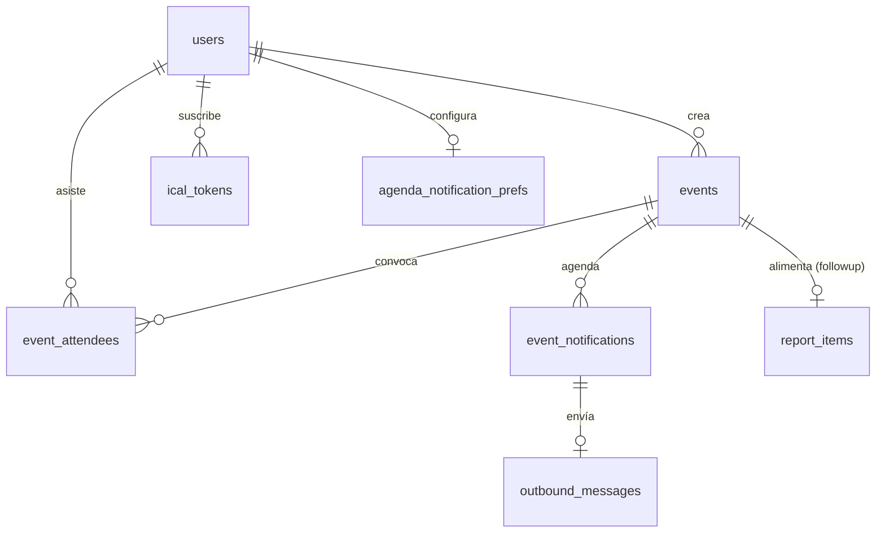

# Modelo de datos — Módulo Agenda

Sigue las convenciones del schema existente (`docs/modelo-de-datos.md`):
- Todas las tablas en `appSchema` (`pgSchema('app')`).
- PK `uuid` con `$defaultFn(() => uuidv7())`.
- Timestamps `timestamptz` (`withTimezone: true`), `created_at`/`updated_at` con `defaultNow()`.
- FK `ON DELETE RESTRICT` por default; `CASCADE` solo donde tiene sentido semántico.
- Archivos nuevos en `apps/web/src/db/schema/`, re-exportados desde `index.ts`.

---

## Diagrama



---

## Enums nuevos (`db/schema/enums.ts`)

```ts
export const eventTypeEnum = pgEnum('event_type', [
  'personal',      // privado, solo el dueño, sin convocatoria
  'secretariat',   // visible a los 27, confirmación opcional
  'mobilization',  // visible a los 27, confirmación obligatoria + tablero
]);

export const eventStatusEnum = pgEnum('event_status', [
  'pending_confirmation', // parseado por IA, esperando SÍ/NO/EDITAR del creador
  'proposed',             // institucional propuesto por secretary común, espera aprobación
  'confirmed',            // activo
  'cancelled',            // cancelado
  'done',                 // ya ocurrió (lo marca el cron post-evento)
]);

export const attendeeStatusEnum = pgEnum('attendee_status', [
  'invited',      // se le mandó convocatoria, sin responder aún
  'going',        // ✅ Voy
  'not_going',    // ❌ No puedo
  'maybe',        // 🤔 Tal vez
  'no_response',  // cerró la ventana sin responder
  'on_leave',     // estaba de licencia en la fecha (no se le convocó)
]);

export const eventNotificationKindEnum = pgEnum('event_notification_kind', [
  'invitation',
  'reminder_7d',
  'reminder_24h',
  'reminder_12h', // legacy: ya no se ofrece en UI (2026-06-09)
  'reminder_2h',
  'reminder_0h',  // al momento del evento (para reuniones online)
  'followup',     // "¿cómo salió?" al creador, día después
  'cancellation', // aviso de cancelación/reprogramación (exento del tope)
]);

export const eventNotificationStatusEnum = pgEnum('event_notification_status', [
  'pending',
  'sent',
  'skipped',  // no se envió (on_leave, tope alcanzado, ya confirmó, etc.)
  'failed',
]);

export const icalScopeEnum = pgEnum('ical_scope', [
  'all',
  'secretariat',
  'personal',
]);
```

### Modificaciones a enums existentes (migración con `ALTER TYPE ... ADD VALUE`)

```ts
// messageIntentEnum  += 'event_create', 'event_confirmation_reply'
// outboundPurposeEnum += 'event_invitation', 'event_reminder', 'event_followup', 'event_proposal'
// aiPurposeEnum       += 'parse_event'
```

> Nota Postgres: `ALTER TYPE ... ADD VALUE` no corre dentro de una transacción junto a otros statements en algunas versiones. Drizzle genera la migración; verificar que cada `ADD VALUE` quede en su propio statement. No se pueden borrar valores de un enum.

---

## `events`

| Campo | Tipo | Notas |
|---|---|---|
| `id` | uuid PK | |
| `title` | text NOT NULL | título corto del evento |
| `description_md` | text NULL | detalle |
| `type` | `event_type` NOT NULL | personal / secretariat / mobilization |
| `status` | `event_status` NOT NULL DEFAULT 'pending_confirmation' | |
| `starts_at` | timestamptz NOT NULL | hora en ART, guardada como UTC |
| `ends_at` | timestamptz NULL | opcional |
| `all_day` | boolean NOT NULL DEFAULT false | |
| `location` | text NULL | lugar (texto libre) |
| `created_by` | uuid FK users | autor |
| `approved_by` | uuid FK users NULL | quién aprobó (si venía como `proposed`) |
| `approved_at` | timestamptz NULL | |
| `requires_confirmation` | boolean NOT NULL DEFAULT false | true siempre en mobilization |
| `is_important` | boolean NOT NULL DEFAULT false | evento **no silenciable**: ignora las preferencias del destinatario. Solo lo setean `executive`/`press_admin`. Default `true` para `mobilization`. |
| `reminder_config` | jsonb NOT NULL | recordatorios que el evento dispara: `{ "7d":bool, "24h":bool, "12h":bool, "2h":bool, "followup":bool }` |
| `outcome_md` | text NULL | respuesta a "¿cómo salió?" |
| `outcome_reported_at` | timestamptz NULL | |
| `outcome_report_item_id` | uuid FK report_items NULL | ítem de reporte que generó el followup |
| `cancellation_reason` | text NULL | |
| `cancelled_by` | uuid FK users NULL | |
| `cancelled_at` | timestamptz NULL | |
| `source` | text NOT NULL | 'whatsapp' \| 'panel' |
| `created_at` / `updated_at` | timestamptz | |

Índices: `starts_at`, `type`, `status`, `created_by`, `(status, starts_at)` compuesto.

**Sin FK a `weekly_cycles`** (decisión 7). El ciclo se deriva: `year`+`iso_week` de `starts_at` con el helper `cycleForDate()` (a extraer en Fase A1). Queries del trigger/followup buscan por rango `starts_at BETWEEN cycle.starts_at AND cycle.ends_at`.

**`reminder_config`**: tope de 4 notificaciones por persona por evento (sin contar `followup`, `cancellation` ni `invitation`... ver regla abajo). Default por tipo desde `system_settings.agenda_reminder_defaults`.

> **Regla del tope de 4** (req): máximo 4 mensajes por persona por evento. Se cuentan `invitation` + recordatorios habilitados. Como hay 5 recordatorios posibles (invitation, 7d, 24h, 12h, 2h), **no se pueden habilitar todos**. Default: `invitation` + `24h` + `12h` + `2h` = 4. Si se habilita `7d`, el código fuerza a desactivar otro para no pasar de 4. `cancellation` está **exenta** (es crítica). `followup` va solo al creador, cuenta aparte.

---

## `event_attendees`

Una fila por (evento, usuario convocado). Solo para `secretariat`/`mobilization`.

| Campo | Tipo | Notas |
|---|---|---|
| `id` | uuid PK | |
| `event_id` | uuid FK events **ON DELETE CASCADE** | |
| `user_id` | uuid FK users | |
| `status` | `attendee_status` NOT NULL DEFAULT 'invited' | |
| `responded_at` | timestamptz NULL | |
| `response_source` | text NULL | 'whatsapp' \| 'panel' |
| `created_at` / `updated_at` | timestamptz | |

Constraint: `UNIQUE(event_id, user_id)`.
Índices: `event_id`, `user_id`, `status`.

Generación: al pasar el evento a `confirmed`, se crea una fila por cada `secretary`/`executive` activo. A los que tengan `absence` cubriendo `starts_at` se les crea con `status='on_leave'` (no se les convoca).

---

## `event_notifications`

Cola pre-computada + log de notificaciones. Es el corazón del scheduling.

| Campo | Tipo | Notas |
|---|---|---|
| `id` | uuid PK | |
| `event_id` | uuid FK events **ON DELETE CASCADE** | |
| `user_id` | uuid FK users | destinatario |
| `kind` | `event_notification_kind` NOT NULL | |
| `scheduled_for` | timestamptz NOT NULL | cuándo debe salir |
| `status` | `event_notification_status` NOT NULL DEFAULT 'pending' | |
| `sent_at` | timestamptz NULL | |
| `skip_reason` | text NULL | 'on_leave' \| 'cap_reached' \| 'already_confirmed' \| 'event_cancelled' \| 'user_muted' |
| `outbound_message_id` | uuid FK outbound_messages NULL | link al envío real |
| `created_at` | timestamptz | |

Constraint: `UNIQUE(event_id, user_id, kind)`.
Índices: `(status, scheduled_for)` (el query del cron), `event_id`, `user_id`.

Lógica de despacho (cron horario):
1. Tomar `status='pending' AND scheduled_for <= now()`.
2. Re-chequear en el momento del envío: si el destinatario quedó `on_leave`, o el evento fue cancelado, o ya respondió `going`/`not_going` y el `kind` es un recordatorio a "sin responder" → `status='skipped'` con `skip_reason`.
3. **Preferencias del destinatario** (R1): si el `kind` es un recordatorio (`reminder_*`) y el usuario lo silenció en `agenda_notification_prefs`, **y** el evento **no** es `is_important` → `status='skipped'`, `skip_reason='user_muted'`. Si `is_important=true`, se ignora la preferencia y se envía igual. La `invitation` **nunca** se silencia (hay que saber que te convocaron); solo los recordatorios son silenciables.
4. Si pasa, enviar (template Meta), insertar `outbound_messages`, linkear, `status='sent'`.

Reglas de audiencia por `kind`:
- `reminder_24h`: a confirmados (`going`) + última llamada a `invited`/`maybe`/`no_response`.
- `reminder_12h`: solo a "sin responder" (`invited`/`no_response`).
- `reminder_2h`: solo a confirmados (`going`).
- `reminder_7d`: a todos los convocados activos.
- `followup`: solo al `created_by`.

---

## `ical_tokens`

Tres tokens de suscripción por usuario (decisión 6).

| Campo | Tipo | Notas |
|---|---|---|
| `id` | uuid PK | |
| `user_id` | uuid FK users **ON DELETE CASCADE** | |
| `scope` | `ical_scope` NOT NULL | all / secretariat / personal |
| `token` | text NOT NULL UNIQUE | random url-safe (~43 chars base64url, mismo generador que `access_tokens`) |
| `revoked_at` | timestamptz NULL | regenerar = revocar el anterior y crear nuevo |
| `last_accessed_at` | timestamptz NULL | auditoría, no afecta validez |
| `created_at` | timestamptz | |

Constraint: `UNIQUE(user_id, scope) WHERE revoked_at IS NULL` (un token activo por scope por usuario).
Índices: `token` (lookup del feed), `user_id`.

El feed `GET /api/ical/[token].ics` resuelve el token → user + scope → eventos visibles → serializa VEVENTs. Solo lectura, sin auth de sesión.

---

## `agenda_notification_prefs`

Preferencias de notificación **por secretario** (R1, refinamiento 2026-06-07). Una fila por usuario. Define qué recordatorios quiere recibir; no afecta eventos `is_important`.

| Campo | Tipo | Notas |
|---|---|---|
| `user_id` | uuid PK FK users **ON DELETE CASCADE** | |
| `prefs` | jsonb NOT NULL | qué recordatorios acepta por tipo de evento |
| `updated_at` | timestamptz | |

Forma de `prefs` (ausencia de key = hereda el `reminder_config` del evento):
```json
{
  "secretariat":  { "7d": false, "24h": true, "12h": false, "2h": false, "0h": true },
  "mobilization": { "7d": false, "24h": true, "12h": false, "2h": true,  "0h": false }
}
```

> **Cambio 2026-06-09**: en UI los tipos se muestran como **Online** (`secretariat`) y **Presencial** (`mobilization`). Defaults: online = 24h + al momento del evento (`0h`); presencial = 24h + 2h. La opción de 12h quedó legacy (eventos viejos pueden tenerla).

Reglas:
- Solo aplica a recordatorios (`reminder_*`). La `invitation` y la `cancellation` siempre se mandan.
- **No aplica si `event.is_important = true`**: esos eventos pisan la preferencia (los pone Mesa Ejecutiva / Prensa y son obligatorios).
- Si el usuario no tiene fila o no tiene key para ese tipo → se respeta el `reminder_config` del evento (opt-out, no opt-in: por default recibís lo que el evento manda).
- Se evalúa en el **dispatch** (no al generar las filas), porque las preferencias pueden cambiar después de creado el evento.

---

## `system_settings` nuevas keys

| Key | Valor (jsonb) | Uso |
|---|---|---|
| `agenda_reminder_defaults` | `{ "personal": {...}, "secretariat": {...}, "mobilization": {...} }` | reminder_config por defecto según tipo |
| `agenda_max_notifications_per_event` | `4` | tope configurable |
| `whatsapp_meta_templates` | (existente) | agregar keys: `agenda_invitation`, `agenda_reminder`, `agenda_followup`, `agenda_proposal_approval` |
| `agenda_ical_include_personal_in_all` | `true` | si el feed `all` incluye los personales |

---

## Modificaciones a tablas existentes

- **`report_items`**: ya tiene `source_message_id`. Para trazar el ítem generado por un followup de evento, se usa `events.outcome_report_item_id` (FK desde events). No hace falta tocar `report_items`.
- **Ninguna columna nueva en `users`, `absences`, `weekly_cycles`, `reports`.** Toda la integración es por query.

---

## Cómo se asigna un evento a un ciclo (sin FK)

```ts
// lib/dates.ts (extraer de cycles/ensure-next en Fase A1)
function cycleKeyForDate(d: Date): { year: number; isoWeek: number }
// Para el trigger del viernes:
//   events donde created_by = userId
//     AND starts_at BETWEEN cycle.starts_at AND cycle.ends_at
//     AND status IN ('confirmed','done')
```

Si el ciclo del evento todavía no existe en `weekly_cycles` (evento de julio cargado en junio), no pasa nada: se calcula la clave igual, y cuando `cycle-bootstrap` cree esa semana, el evento ya cae por rango de fechas.

---

## Decisiones a confirmar más adelante

- ¿`event_attendees` para `personal`? → No. Personal no convoca a nadie.
- ¿Versionar ediciones de eventos (historial)? → MVP: no. Se audita en `audit_log` el before/after. Si crece, tabla `event_revisions`.
- ¿Eventos recurrentes (todos los martes)? → Fuera de scope del MVP. Si se pide, expandir a filas individuales (no RRULE en DB).
- ¿Adjuntos en eventos (orden del día, PDF)? → MVP: no. `description_md` alcanza.
